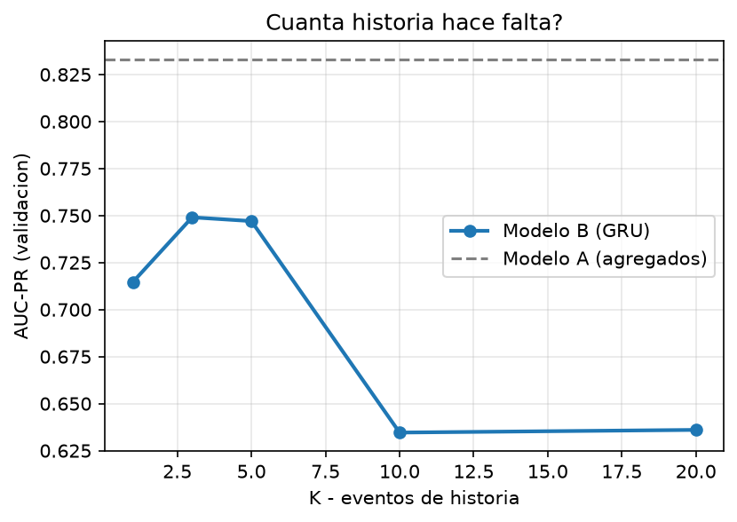

# Monitoreo transaccional — ¿vale la pena leer el orden?

**Proyecto 1 · Deep Learning y Sistemas Inteligentes 2026 (UVG)**
Andres Mazariegos · June Herrera
Corrida de test ejecutada una sola vez: **2026-09-03T01:22:43**

---

## Resumen para el comité

Comparamos dos formas de puntuar el riesgo de una transacción con **la misma
información disponible en el mismo instante**: un motor de agregados como el
que el banco ya usa (Modelo A) y un modelo que además lee la **secuencia
ordenada** de las últimas 20 transacciones de la tarjeta (Modelo B).

**A gana en AUC-PR global** (0.8329 contra 0.7138). Ese es el resultado y no lo maquillamos: sobre el total de transacciones, treinta agregados causales bien construidos rinden más que el modelo secuencial.

**Sí, y se puede demostrar.** Al barajar el orden de la historia sin tocar su contenido, la AUC-PR de B cae 0.1755 (28% de su valor) mientras la de A no se mueve ni un dígito. B estaba leyendo el orden.

Las dos cosas conviven, y esa es la conclusión central del trabajo: el orden
**sí** carga información real, pero esa información está concentrada en un
mecanismo de fraude concreto, no repartida por todo el flujo. La
recomendación es **complementar el motor actual, no reemplazarlo**.

---

## Evidencia 1 · Integridad de los datos

**Origen.** Generador sintético propio, reproducible por semilla
(`SEED_DATOS = 20260831`), entregado como artefacto
(`artefactos/generador_datos.py`). 419,821 transacciones sobre
4,000 tarjetas y un horizonte común de 90 días, con
1.18% de fraude.

Elegimos datos sintéticos porque la prueba de permutación es obligatoria y el
riesgo dominante no era el realismo sino **quedarnos sin señal que medir**.
Para que el experimento no fuera circular, el generador incluye un mecanismo
que **no** depende del orden (`f3`), uno que un simple conteo ya captura
(`f2`), y **ráfagas legítimas confusoras** con la misma firma agregada que el
fraude dependiente del orden e idénticas en canal, país y distribución de
monto: la única diferencia entre ambas es que los montos del fraude **crecen
de forma monótona**. Sin esa precaución el generador habría estado amañado a
favor de uno de los dos modelos.

### Tabla 1 · Partición temporal

| Partición | Transacciones | Desde | Hasta | Fraudes | Tasa |
|---|---:|---|---|---:|---:|
| train | 293,874 | 2026-01-01 | 2026-03-05 | 3,543 | 1.21% |
| val | 62,973 | 2026-03-05 | 2026-03-18 | 703 | 1.12% |
| test | 62,974 | 2026-03-18 | 2026-03-31 | 703 | 1.12% |

El corte es por **percentil de tiempo global**, nunca aleatorio. Una misma
tarjeta puede aparecer en train y en test, que es lo realista: en producción
el modelo puntúa tarjetas que ya conoce. Las tres tasas de fraude son
comparables entre sí, lo que importa porque la AUC-PR depende de la
prevalencia.

**Controles anti-fuga**, todos como tests que corren (`python -m pytest`):
scalers y vocabularios ajustados solo con train; agregados con ventana causal
`closed='left'`; ninguna secuencia mira hacia adelante del instante que
puntúa; `fraud_type` fuera de toda matriz de features; sin sobremuestreo en
ninguna partición.

---

## Evidencia 2 · Comparación común A vs B

Ambos modelos responden literalmente la misma pregunta sobre las mismas
filas: *para la transacción `t` de la tarjeta `c`, ¿es fraudulenta?* Lo único
que cambia es cómo se representa la entrada.

### Tabla 2 · Desempeño en validación

| Modelo | AUC-PR val (media ± σ, 3 semillas) |
|---|---|
| A — Regresión logística (piso) | 0.4649 ± 0.0000 |
| A — LightGBM sobre agregados | 0.8329 ± 0.0025 |
| B — GRU sobre la secuencia | 0.7138 ± 0.0685 |
| C — Híbrido agregados + secuencia | 0.6939 ± 0.0311 |

La regresión logística está como piso de referencia: sin ella no se sabría si
el LightGBM es bueno o si el problema es fácil. La diferencia entre ambos
confirma que la línea base **no** es un hombre de paja.

**Figura 2.** Curvas precisión-exhaustividad superpuestas (validación).

---

## Evidencia 3 · El valor del orden

### Tabla 3 · Prueba de permutación

Barajamos el orden de los eventos de cada ventana **sin alterar su
contenido** y reevaluamos B con **los mismos pesos ya entrenados**, sin
reentrenar nada.

La prueba corre sobre el modelo de **una** semilla (la 7), cuya AUC-PR es
0.6360; por eso esta cifra no coincide con la media de 0.7138 de la
Tabla 2, que promedia las tres. La dispersión entre semillas es alta
(σ = 0.0685), y es una limitación que conviene tener presente al leer
la magnitud de la caída — no su signo, que es inequívoco.

| Variante | AUC-PR de B | Caída de B | AUC-PR de A |
|---|---:|---:|---:|
| Original (sin barajar) | 0.6360 | +0.0000 | 0.8317 |
| Full shuffle (los K eventos) | 0.0232 | +0.6128 | 0.8317 |
| History shuffle (los K−1 previos) | 0.4605 | +0.1755 | 0.8317 |

Dos lecturas:

1. **A no se mueve** (0.8317 en las tres filas). Tenía que ser así:
   media, máximo, conteo y cardinalidad son invariantes a la permutación. Es
   un control de sanidad gratis — si A se hubiera movido, habría fuga de
   orden en el pipeline y toda la comparación sería inválida.
2. **B sí se mueve**, y mucho. El *history shuffle* es la variante limpia:
   deja la transacción que se está clasificando en su sitio y solo desordena
   su historia, así que aísla el aporte del **orden de la historia** del
   efecto de mover el evento objetivo.

### Tabla 4 · Dónde está la ganancia — desglose por mecanismo

Esta es la evidencia más persuasiva del informe, porque el patrón se predijo
**antes** de medirlo.

| Mecanismo | ¿Depende del orden? | AUC-PR A | AUC-PR B | B − A |
|---|---|---:|---:|---:|
| `f1_golpe` | **Sí, fuertemente** | 0.3641 | 0.4644 | +0.1003 |
| `f1_sondeo` | Sí (parte del patrón) | 0.2224 | 0.1163 | -0.1061 |
| `f2` | Parcialmente | 0.9795 | 0.6629 | -0.3166 |
| `f3` | **No** (control negativo) | 0.7856 | 0.4759 | -0.3097 |

La ganancia de B se concentra en `f1_golpe` (+0.1003), que es
exactamente el mecanismo que la teoría dice que requiere leer el orden: una
sucesión de compras pequeñas **crecientes** — el atacante tanteando el
límite — seguida de una compra grande. Los mismos montos en otro orden no
forman el patrón. Y B **no** gana donde la teoría dice que no debería.

### Figura 3 · ¿Cuánta historia hace falta?

| K | AUC-PR val |
|---:|---:|
| 1 | 0.7146 |
| 3 | 0.7491 |
| 5 | 0.7470 |
| 10 | 0.6346 |
| 20 | 0.6360 |

**Figura 3.** AUC-PR contra `K`, con la línea de A como referencia.

Responde una pregunta operativa real: cuánta historia hay que guardar para
puntuar una transacción. Trae además un control de sanidad: con `K=1` el
modelo secuencial no tiene historia que leer y degenera en un clasificador
puntual.

**Ablación de Δt.** Quitando el intervalo entre transacciones y reentrenando, la AUC-PR **sube** de 0.6360 a 0.7253. Es lo contrario de lo que esperábamos: suponíamos que Δt era la variable por la que el tiempo entra al modelo, y resulta que en esta configuración le estorba. La lectura honesta es que Δt, tal como lo escalamos, aporta más ruido que señal, y que la dependencia del orden que sí demuestra la permutación vive en la posición de los eventos y no en el hueco temporal entre ellos.

---

## Evidencia 4 · La apuesta del equipo

**Hipótesis, registrada el 2026-09-03T01:17:08, antes de entrenar:**

> Creemos que concatenar el estado oculto del GRU con el vector de agregados de A antes de la capa de salida mejorara la AUC-PR en validacion porque f2 y f3 son mayormente capturables por agregados mientras que f1 requiere orden, y ningun modelo puro cubre ambos regimenes. Lo consideraremos util si la AUC-PR en validacion supera a la del mejor de A y B por al menos 0.02 absoluto, promediado sobre 3 semillas.

**Control:** A solo y B solo, misma partición y mismas semillas.

**Resultado:** C = 0.6939 contra un mejor puro de
0.8329. Ganancia de -0.1390, con un criterio
declarado de ≥ 0.02.

**Veredicto: la hipótesis NO se sostuvo.**
Concatenar los agregados al estado oculto del GRU no alcanzó la mejora que declaramos. Lo reportamos como salió: un resultado negativo con su control es evidencia, y maquillarlo sería lo único que no vale nada.

---

## Evidencia 5 · La decisión económica

Los puntajes de una red entrenada con `class_weight` no son probabilidades,
así que antes de traducirlos a quetzales los calibramos con regresión
isotónica ajustada **en validación**.

**El umbral óptimo no es 0.5, es ~4.3 %.** Dejar pasar un fraude cuesta
Q4,200 y bloquear una compra legítima cuesta
Q180: 23 veces menos. La
regla de Bayes da `p* = 180/4200 = 0.0429`. Barrimos el umbral sobre
validación, lo **congelamos**, y lo aplicamos a test sin reoptimizar.

### Tabla 5 · Resultados sobre test

| Modelo | AUC-PR | u* | Precisión | Recall | F1 | Costo |
|---|---:|---:|---:|---:|---:|---:|
| A — LightGBM | 0.8499 | 0.0400 | 0.453 | 0.967 | 0.617 | Q244,560 |
| B — GRU | 0.6224 | 0.0320 | 0.302 | 0.903 | 0.452 | Q550,200 |
| C — Hibrido | 0.7466 | 0.0330 | 0.351 | 0.906 | 0.506 | Q489,240 |

**Traducción.** Con A — LightGBM, el sistema detecta
**97% de los fraudes** (680
de 703) bloqueando **1 de cada
75 compras legítimas**
(822 molestias sobre 62,271 compras buenas).

**Impacto mensual estimado.** Extrapolando los 13.4 días de
test a un mes de 30 días (4,694 transacciones/día), y tomando
el motor de agregados (A) como línea base:

- B contra A: **cuesta Q683,480 MAS**
- C contra A: **cuesta Q547,160 MAS**

Es una **extrapolación** y conviene decirlo con todas sus letras: supone que
el mes se parece al periodo de test en volumen, mezcla de mecanismos y
prevalencia, y que los costos son fijos y uniformes para toda transacción.

**Figura 4.** Costo(u) para A, B y C sobre test, con cada `u*` marcado y el
umbral teórico de 0.0429 como referencia.

---

## Evidencia 6 · Recomendación y límites

### Recomendación: **conservar el motor actual**, con el secuencial como sonda acotada

Desplegar B como decisor costaría **Q683,480 más al mes** que el motor de agregados. Con esa cifra sobre la mesa, recomendar 'complementar' sin más sería una recomendación cara: el orden aporta información demostrable, pero no la suficiente para pagar por ella en el flujo completo.

Lo que sí se sostiene es un uso **acotado y no bloqueante**: el motor actual sigue decidiendo, y el modelo secuencial marca para *revisión manual* los casos con firma de `f1_golpe`, que es el único mecanismo donde supera a los agregados (+0.1003 de AUC-PR). Eso captura la ganancia donde existe sin trasladar su costo al resto del flujo, y sin quitarle al analista la explicabilidad de los agregados.

### Un patrón de error concreto

Lo declaramos antes de entrenar y se confirmó: **cuando la brecha entre las
compras de sondeo y el golpe supera las 24 h, la ventana de K=20 eventos no
alcanza a contener ambos extremos del patrón** y el golpe queda siendo, para
el modelo, una compra grande sin contexto. El otro modo de fallo declarado
son las tarjetas con menos de K transacciones de historia, donde la secuencia
va rellena de padding.

### Condiciones bajo las que cambiaríamos la recomendación

- Si la prevalencia de fraude dependiente del orden subiera en el flujo real.
- Si el costo de un falso negativo dejara de ser uniforme y escalara con el
  monto: eso favorece al modelo que mejor ordena en la cola alta.
- **No** ampliar la ventana. Nuestra propia curva de recorte dice que el óptimo está en K=3 y que K=20 —el que usamos para todo lo demás— rinde peor. Revisaríamos la recomendación si al reentrenar B en K=3 la comparación económica cambiara de signo; es la primera prueba que correríamos con más tiempo.

---

## Matriz de evidencias

| Evidencia | Figura/Tabla | Conclusión | Limitación |
|---|---|---|---|
| Partición temporal | Tabla 1 | Sin fuga temporal; test posterior a validación, prevalencias comparables | Una sola ventana; sin validación rolling |
| A vs B | Tabla 2, Fig. 2 | A gana en AUC-PR global (0.833 vs 0.714) | Una sola arquitectura de cada familia; 3 semillas |
| Permutación | Tabla 3 | B cae 0.175 al barajar la historia; A invariante | No prueba *qué* orden usa, solo que lo usa |
| Desglose por mecanismo | Tabla 4 | La ganancia se concentra en `f1_golpe` (+0.100) | Pocos episodios por mecanismo; σ no despreciable |
| Recorte de historia | Fig. 3 | Mejor AUC-PR en K=3 | K>20 no explorado |
| Apuesta C | — | El híbrido no alcanzó el umbral declarado | Una sola configuración de fusión probada |
| Umbral y costo | Tabla 5, Fig. 4 | u* congelado en validación; cuesta Q683,480 MAS al mes frente a A | Costos fijos y uniformes; datos sintéticos; calibrador y u* ajustados ambos en validación |
| Datos | — | Generador reproducible, no amañado a favor de B (f3 sin orden, ráfagas confusoras) | **Sintéticos**: no prueban que el patrón exista en el flujo real |
