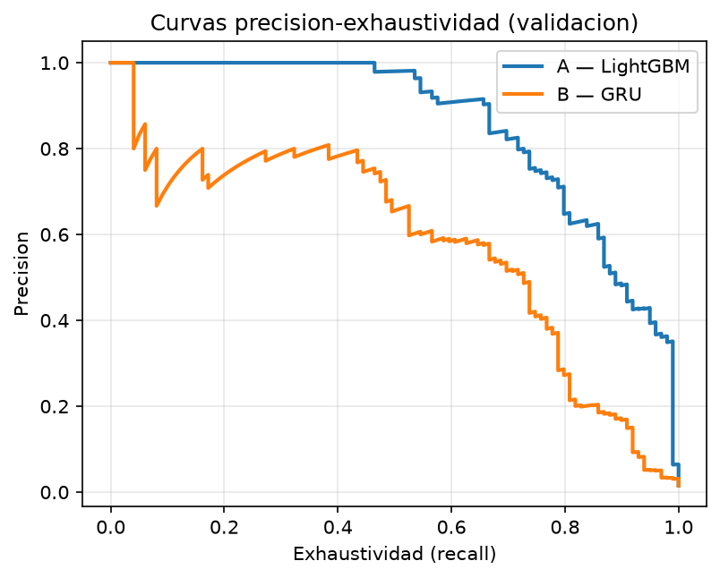
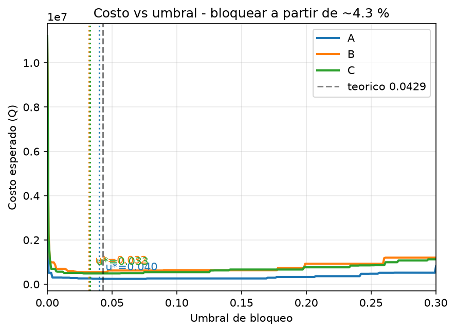

# Presentación — 8 diapositivas / 8 minutos

> Guion de apoyo. Una diapositiva por bloque; las cifras vienen de
> `artefactos/resultados_informe.json`, generadas por la corrida del notebook.

---

## 1 · La pregunta y la apuesta metodológica

**¿El orden de las transacciones aporta información que los agregados no
capturan — y cuánto vale en quetzales?**

- A y B responden **la misma pregunta sobre las mismas filas**: ¿es fraudulenta
  la transacción `t`, con lo disponible en el instante `t`?
- Lo único que cambia es la representación: 20 agregados causales contra
  la secuencia ordenada de 20 eventos.
- Una mejora de métricas no prueba nada por sí sola. Por eso la prueba de
  permutación no es un extra: es lo que convierte "B ganó" en "B ganó **porque
  leyó el orden**".

*Hablar 45 s. No entrar en arquitectura todavía.*

---

## 2 · Los datos, y por qué esto no es circular

419,821 transacciones · 4,000 tarjetas · 90 días ·
1.18% de fraude · generador reproducible por semilla.

**La objeción esperable es "usted lo construyó para que B ganara".** La
respuesta, en tres piezas:

| Mecanismo | ¿Depende del orden? | Quién debería ganar |
|---|---|---|
| `f1` sondeo y golpe | **Sí, fuertemente** | B |
| `f2` ráfaga de cajero | Parcialmente | empate |
| `f3` monto atípico aislado | **No** | empate — control negativo |

Y además: **ráfagas legítimas confusoras** con la misma firma agregada que f1 e
idénticas en canal, país y monto. La única diferencia es que en f1 los montos
**crecen de forma monótona**. Sin eso, A habría ganado sin leer orden — media,
máximo y conteo son invariantes a la permutación.

---

## 3 · Protocolo: partición temporal y anti-fuga

- Corte por **percentil de `ts` global**, nunca aleatorio.
- Train 0–70 · Val 70–85 · Test 85–100.
- Scalers, vocabularios e hiperparámetros: `fit` **solo en train**.
- **El test se tocó una sola vez**, el 2026-09-03T01:22:43, con `u*` ya
  congelado.

Todo el checklist anti-fuga es una **suite ejecutable**, no una promesa:
`python -m pytest` corre 129 tests, incluido `test_integridad.py`, que es §9
del enunciado convertido en aserciones.

---

## 4 · Resultado A vs B

| Modelo | AUC-PR validación |
|---|---|
| A — LightGBM sobre agregados | **0.8329** |
| B — GRU sobre la secuencia | **0.7138** |
| C — Híbrido | 0.6939 |

**A gana en AUC-PR global, y lo decimos tal cual.**
Treinta agregados causales bien construidos rinden más, sobre el total del flujo, que el modelo secuencial. Ese es el resultado; maquillarlo sería lo único que no valdría nada.



*Aquí viene el giro: el promedio global esconde dónde está la señal.*

---

## 5 · La prueba de falsificación — permutación

Barajamos el orden **sin tocar el contenido** y reevaluamos B con **los mismos
pesos**. Sin reentrenar.

| Variante | AUC-PR de B | Caída |
|---|---:|---:|
| Original | 0.6360 | — |
| Full shuffle | 0.0232 | **+0.6128** |
| History shuffle | 0.4605 | **+0.1755** |

**A no se movió ni un dígito** (0.8317 en las tres
filas). Tenía que ser así, y es un control de sanidad gratis: si A se hubiera
movido, habría fuga de orden y toda la comparación sería inválida.

*Frase para decir en voz alta: "el contenido de la ventana es idéntico; lo
único que cambió fue el orden, y B perdió 28% de su desempeño."*

---

## 6 · Dónde está la ganancia (la diapositiva que convence)

| Mecanismo | AUC-PR A | AUC-PR B | B − A |
|---|---:|---:|---:|
| `f1_golpe` | 0.364 | 0.464 | **+0.100** |
| `f2` | 0.980 | 0.663 | **-0.317** |
| `f3` | 0.786 | 0.476 | **-0.310** |

**El patrón se predijo antes de medirlo.** La ganancia se concentra en
`f1_golpe` — el mecanismo que exige leer el orden — y **no** aparece en `f3`,
el control negativo. Que la ventaja esté exactamente donde la teoría dice, y
solo ahí, es más persuasivo que cualquier promedio global.

---

## 7 · La decisión económica

**El umbral óptimo no es 0.5, es 4.3 %.**

```
p* = Q180 / Q4,200 = 0.0429
```

Dejar pasar un fraude cuesta **23 veces más** que molestar a un cliente
legítimo. `u*` se barrió sobre validación y se **congeló** antes de test.

Con A — LightGBM: detecta **97% de los fraudes**, bloqueando
**822** compras legítimas de 62,271.

Impacto mensual estimado (extrapolado de 13.4 días),
tomando A como línea base: B **cuesta Q683,480 MAS al mes**.



*Decir explícitamente que es una extrapolación con costos fijos y uniformes.*

---

## 8 · Recomendación

### Conservar el motor actual. Secuencial como sonda acotada.

- Desplegar B como decisor **cuesta Q683,480 más al mes**. El orden aporta información demostrable, pero no alcanza para pagarla en el flujo completo.
- La ganancia es **real pero estrecha**: vive en `f1_golpe` (+0.1003 de AUC-PR) y en ningún otro mecanismo.
- Forma concreta: el motor actual decide; el secuencial **marca para revisión manual** los casos con firma de `f1_golpe`. No bloquea.
- El motor de agregados es además más barato, más rápido y **explicable** ante
  un cliente al que se le bloqueó una compra.

### Límite honesto

Los datos son sintéticos. Lo que demostramos es que **si** existe un patrón
dependiente del orden, un GRU lo encuentra y los agregados no. **No**
demostramos que ese patrón exista en el flujo real del banco.

### Modo de fallo declarado y confirmado

Cuando la brecha entre los sondeos y el golpe supera 24 h, no caben en la
ventana de 20 eventos y el golpe queda siendo una compra grande sin
contexto.

---

## Apéndice — las tres decisiones técnicas (se elige una al azar)

1. **GRU vs LSTM / CNN 1D / Transformer.** Con K=20 no hay dependencia
   larga que recordar; el Transformer está sobredimensionado; la CNN 1D ve
   patrones locales pero f1 exige **acumular estado** para notar que los montos
   *crecen*.
2. **K=20 fue elegido a dedo, y la curva lo desmintió.** El óptimo está en K=3 (Fig. 3); K=20 rinde 0.11 por debajo. Todo el proyecto está construido sobre K=20, así que B queda evaluado en su peor configuración y el valor del orden sale **subestimado**. Defender esta decisión es defender el hallazgo, no la elección.
3. **Ruta A sintética.** Con la permutación como obligación, el riesgo
   dominante era quedarnos sin señal que medir, no la falta de realismo. La
   circularidad se mitiga con f3, con f2 y con las ráfagas confusoras.

*Extras por si preguntan:* umbral por costo y no por F1; `class_weight` y no
SMOTE; AUC-PR sobre puntaje crudo porque la isotónica crea empates.
